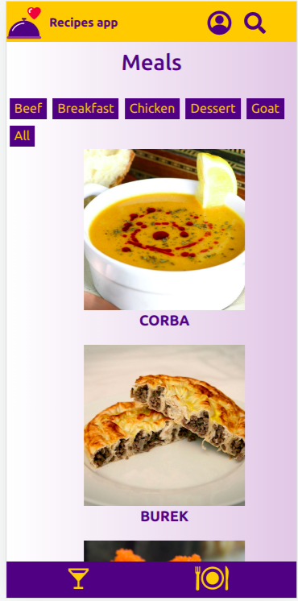
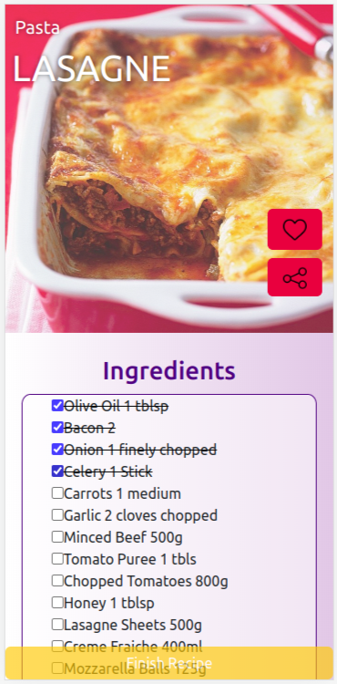

<h1>Recipes App</h1>

A recipe app to make that lunch that no one talks about because it's so delicious.

<h2>🚀 Objective</h2>

To develop a recipe app using the latest in the React ecosystem: Hooks and Context API. The app should allow users to view, search, filter, favorite, and track the preparation progress of food and drink recipes without losing data when the user leaves the page.
 

I believe this entire project was challenging, from implementing the filters, which always make a new request, to building the entire system of favoriting recipes in localStorage. Being one of the biggest group projects helped me develop the soft skills that are so important in the job market.

<h2>🛠️ Built With</h2>

<strong><em>JavaScript</em></strong> 
<strong><em>React</em></strong> 
<strong><em>React Testing Library</em></strong> 
<strong><em>Context API</em></strong> 
<strong><em>React Hooks</em></strong> 

<h3>Project Look</h3>

  
  

I am available for contact, suggestions, and feedback on the project.

<h2>🎁 Expressions of Gratitude</h2>

Tell others about this project. 📢

